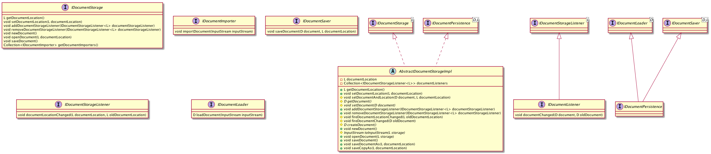

# Document-based storage of domain data

By *document-based storage* we mean a storage model where a *document* containing domain data is loaded/saved *as a whole*, from/to some explicitly provided *location*. This storage model is typical for document-centric desktop apps with a **File** menu containing actions like **open**, **save**, **save-as** etc. The interfaces and implementation classes described here are designed to support such **File** menu actions. A class diagram of the main classes related to location-based storage is shown below.

* **IDocumentStorage**: An interface with the methods necessary for supporting the standard **File** menu actions. The interface is parameterized with the type used for representing the location to load from or save to. The class representing the document (domain data container) is implicit in the implementation of this interface. The interface includes methods for getting and setting the location and creating, opening and saving the (current) document.
* **IDocumentImporter**: An interface with a method for importing domain data from a location. The interface is parameterized with the location type. The main use is supporting an **import** action in a **File** menu. 

* **IDocumentLoader**: An interface with a method for loading and returning a document (domain data container) from an **InputStream**. The interface is parameterized with the document type. This allows various ways of loading or importing domain data, with different sources and formats.
* **IDocumentSaver**: An interface with a method for saving a document (domain data container) to a location. The interface is parameterized with the document and location types. This allows various ways of saving or exporting domain data, to different locations and formats.
* **IDocumentPersistence**: Combination of **IDocumentLoader**  and **IDocumentSaver**.

* **IDocumentStorageListener**: Listener interface for the location of the (current) document of an IDocumentStorage, e.g. when a **save-as** action is performed. 
* **IDocumentListener**: Listener interface for the contents of the (current) document of an IDocumentStorage, e.g. when a document is created, opened or imported.

* **AbstractDocumentStorageImpl**: Incomplete implementation of **IDocumentStorage**, to simplify implementing ones for specific document and location types. The main missing methods are for getting and setting the current document, creating an empty one and creating an **InputStream** from a location.

