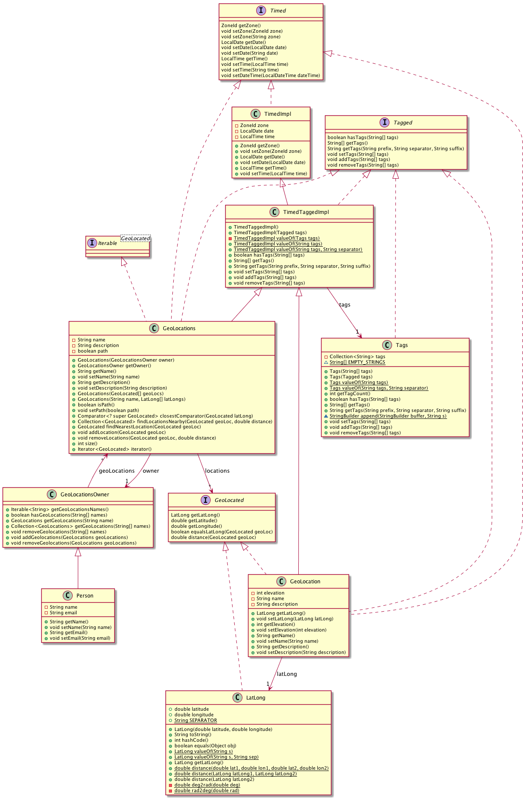

# Domain model for app and REST API

The project is about managing sets of geo-locations, so the domain model includes classes for representing geo-locations, sets of these and owners of such sets. A class diagram of the core model is shown below.

Main types related to geo-locations:
* **LatLong**: Value class representing a geo-location, i.e. latitude, longitude pair. Includes methods for distance calculations.
* **GeoLocated**: Interface for geo-located data, i.e. classes that can return a corresponding **LatLong** object.
* **GeoLocation**: Main implementation of **GeoLocated**. Combines a **LatLong** and *elevation* with generic values like name, description, time (implements **Timed**) and tags (implements **Tagged**).
* **GeoLocations** (unfortunate name): Container for **GeoLocated** objects. Includes a flag indicating of the geo-locations represents a *path* or not. Implements **Timed** and **Tagged**.  
* **GeoLocationsOwner**: Container for **GeoLocations** objects. Meant as an abstract class, but is not since it is useful on its own. 
* **Person**: Main subclass of **GeoLocationsOwner**. Includes *name* and *email* values.

Generally useful types
* **Timed**: Interface for time-related data, including *date*, *time* of day and time *zone*. The idea is that elements left out are filled in with (default) values from the container.
* **TimedImpl**: Main implementation of **Timed**.
* **Tagged**: Interface for tags, i.e. sets of string labels. Includes methods for checking, getting, setting, adding and removing tags.
* **Tags**: Main implementation of **Tagged**.
* **TimedTaggedImpl**: Implementation of both **Timed** and **Tagged**, among others used as superclass for **GeoLocation** and **GeoLocations**.

